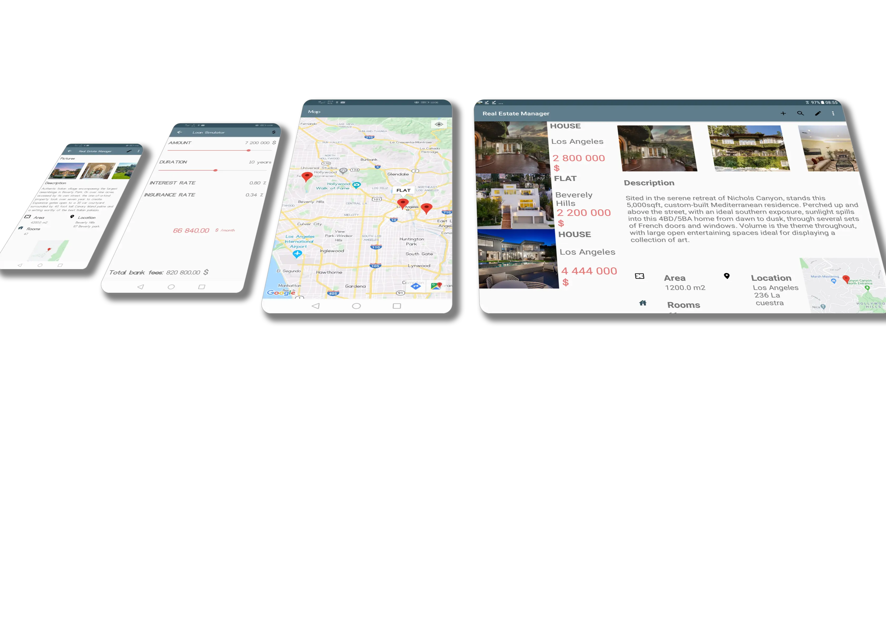

<h1 align="left">RealEstateManager</h1>

Last updated on 11 Apr 2020

<h4>This application allows the staff of a real estate agency to efficiently list the properties offered for sale as well as to offer loan solutions.</h4>

___

## Technical features

- Language : **Kotlin**
- **MVVM** architecture
- **Responsive** UI for tablet and landscape orientation
- Picture storage on the **MediaStore**
- Data persistence on SQLite database with **Room**
- Cross-application read-only access through **ContentProvider**
